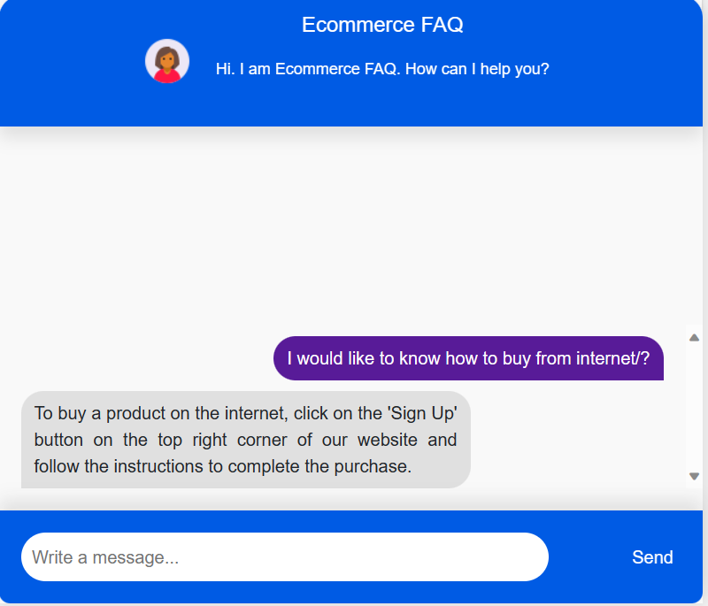

# Building a Responsive Web-based Chatbot with GPT-2 Fine-Tuning using Flask

The integration of powerful language models like GPT-2 into web-based applications has revolutionized the way we interact with technology. Leveraging the capabilities of GPT-2 through fine-tuning and combining it with Flask, a lightweight web framework, allows for the creation of dynamic and responsive chatbots accessible through a web interface.

In this document, we'll explore the process of harnessing GPT-2's potential through fine-tuning and employing Flask to build a responsive webpage-driven chatbot. Additionally, we'll delve into utilizing GPT-2's built-in functions for generating contextually relevant responses and delivering an engaging user experience.

## Understanding GPT-2 Fine-Tuning with Flask

Fine-tuning GPT-2 involves adapting its pre-trained parameters to a specific task or domain, such as chatbot development. Flask, known for its simplicity and flexibility, serves as the backend framework, enabling seamless integration of GPT-2's capabilities into a web-based interface. By combining these technologies, we aim to create a user-friendly chatbot accessible via a web browser.

## Incorporating GPT-2's Built-in Functions

GPT-2 comes with inherent functionalities for text generation, which can be fine-tuned further to suit various conversational contexts. Understanding and implementing these built-in functions within the Flask framework will enable our chatbot to deliver coherent and context-aware responses, enhancing the overall conversational experience.

## Creating a Responsive Webpage

A crucial aspect of our project involves crafting a responsive and intuitive webpage to host the chatbot interface. We'll explore methodologies to design and implement a user-friendly interface using HTML, CSS, and potentially JavaScript to ensure seamless interaction across different devices and screen sizes.

## Contents of this Document

This document aims to serve as a comprehensive guide for developers and enthusiasts interested in building a responsive web-based chatbot using GPT-2 fine-tuning and Flask. Throughout this guide, we'll provide step-by-step instructions, code snippets, and insights to facilitate the creation of an efficient and interactive chatbot system.

Let's embark on a journey to combine the power of GPT-2 fine-tuning, Flask, and responsive web design to craft a sophisticated and user-friendly chatbot application.

## Chatbot UI

<!--  -->
